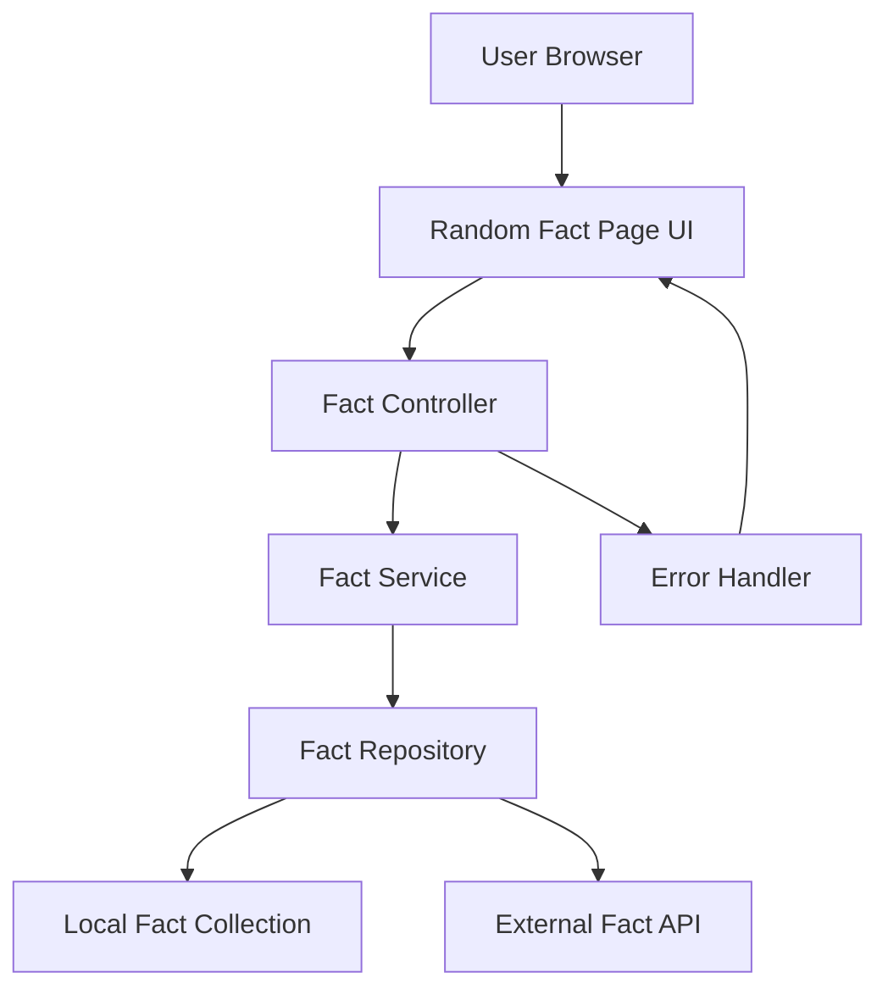
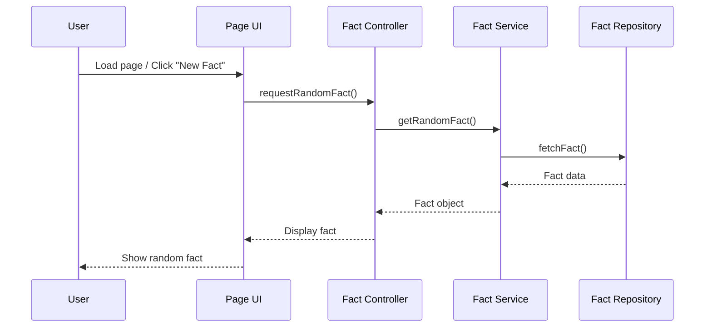
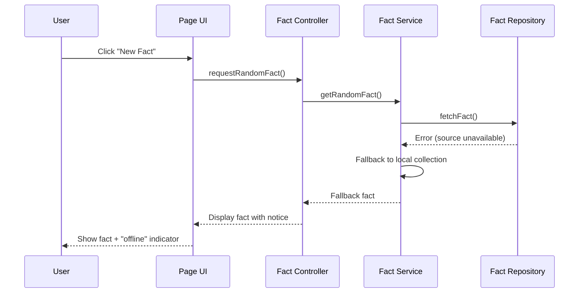

# Design Document: Random Fact Page

## Overview

The Random Fact Page is a web-based feature that displays a random fact to the user each time the page is loaded or a refresh action is triggered. The page provides a simple, clean interface with a fact display area and a button to fetch a new random fact. Facts are sourced from a local collection or an external API, with graceful error handling when the source is unavailable.

The feature includes comprehensive test cases covering unit tests, integration tests, and property-based tests to ensure correctness and reliability of the fact retrieval and display logic.

## Architecture



## Sequence Diagrams

### Main Flow: Load Random Fact



### Error Flow: Fact Source Unavailable



## Components and Interfaces

### Component 1: Page UI

**Purpose**: Renders the random fact page and handles user interactions.

```pascal
INTERFACE PageUI
  displayFact(fact: Fact): VOID
  showLoading(): VOID
  showError(message: String): VOID
  onNewFactRequested(callback: PROCEDURE): VOID
END INTERFACE
```

**Responsibilities**:
- Render the fact text in a readable format
- Provide a "New Fact" button for user interaction
- Display loading state while fetching
- Show error messages gracefully

### Component 2: Fact Controller

**Purpose**: Orchestrates the flow between UI and service layer.

```pascal
INTERFACE FactController
  requestRandomFact(): Fact
  initialize(): VOID
END INTERFACE
```

**Responsibilities**:
- Handle user requests for new facts
- Coordinate between UI and service
- Manage loading and error states

### Component 3: Fact Service

**Purpose**: Business logic for retrieving and selecting random facts.

```pascal
INTERFACE FactService
  getRandomFact(): Fact
  getFactById(id: Integer): Fact
  getFactCount(): Integer
END INTERFACE
```

**Responsibilities**:
- Select a random fact from available sources
- Implement fallback logic when primary source fails
- Ensure no consecutive duplicate facts

### Component 4: Fact Repository

**Purpose**: Data access layer for fact storage and retrieval.

```pascal
INTERFACE FactRepository
  fetchFact(): Fact
  fetchAllFacts(): List OF Fact
  fetchFactByIndex(index: Integer): Fact
  getCount(): Integer
END INTERFACE
```

**Responsibilities**:
- Access local fact collection
- Optionally call external fact API
- Handle data source errors

## Data Models

### Model 1: Fact

```pascal
STRUCTURE Fact
  id: Integer
  text: String
  category: String
  source: String
END STRUCTURE
```

**Validation Rules**:
- `id` must be a positive integer
- `text` must be non-empty and no longer than 500 characters
- `category` must be one of: "science", "history", "nature", "technology", "general"
- `source` must be either "local" or "api"

### Model 2: FactResponse

```pascal
STRUCTURE FactResponse
  fact: Fact
  isFromFallback: Boolean
  timestamp: DateTime
END STRUCTURE
```

**Validation Rules**:
- `fact` must be a valid Fact structure
- `isFromFallback` indicates if the primary source was unavailable
- `timestamp` must be a valid date-time value

## Algorithmic Pseudocode

### Main Processing Algorithm: Get Random Fact

```pascal
ALGORITHM getRandomFact()
INPUT: none
OUTPUT: factResponse of type FactResponse

BEGIN
  previousFactId ← getLastDisplayedFactId()
  
  // Step 1: Attempt to fetch from primary source
  TRY
    facts ← repository.fetchAllFacts()
    ASSERT facts IS NOT EMPTY
    
    // Step 2: Select random fact avoiding duplicates
    selectedFact ← selectRandomFact(facts, previousFactId)
    
    // Step 3: Build response
    factResponse ← CREATE FactResponse
    factResponse.fact ← selectedFact
    factResponse.isFromFallback ← FALSE
    factResponse.timestamp ← NOW()
    
    storeLastDisplayedFactId(selectedFact.id)
    
    RETURN factResponse
    
  CATCH sourceError
    // Step 4: Fallback to local collection
    localFacts ← loadLocalFacts()
    
    IF localFacts IS EMPTY THEN
      RAISE Error("No facts available")
    END IF
    
    selectedFact ← selectRandomFact(localFacts, previousFactId)
    
    factResponse ← CREATE FactResponse
    factResponse.fact ← selectedFact
    factResponse.isFromFallback ← TRUE
    factResponse.timestamp ← NOW()
    
    RETURN factResponse
  END TRY
END
```

**Preconditions:**
- Repository is initialized and accessible
- At least one fact source (local or remote) contains facts

**Postconditions:**
- Returns a valid FactResponse with a non-empty fact
- The returned fact is different from the previously displayed fact (when possible)
- `isFromFallback` accurately reflects whether the primary source was used

**Loop Invariants:** N/A (no loops in main algorithm)

### Random Selection Algorithm

```pascal
ALGORITHM selectRandomFact(facts, excludeId)
INPUT: facts (List OF Fact), excludeId (Integer or NULL)
OUTPUT: selectedFact of type Fact

BEGIN
  ASSERT facts IS NOT EMPTY
  
  // Filter out the previously shown fact if possible
  availableFacts ← facts
  
  IF excludeId IS NOT NULL AND LENGTH(facts) > 1 THEN
    availableFacts ← FILTER facts WHERE fact.id ≠ excludeId
  END IF
  
  // Generate random index
  randomIndex ← RANDOM(0, LENGTH(availableFacts) - 1)
  selectedFact ← availableFacts[randomIndex]
  
  ASSERT selectedFact.text IS NOT EMPTY
  ASSERT selectedFact.id > 0
  
  RETURN selectedFact
END
```

**Preconditions:**
- `facts` list contains at least one valid Fact
- Each fact in the list has a unique `id`

**Postconditions:**
- Returns a valid Fact from the input list
- If `excludeId` is provided and list has more than one item, returned fact has a different id
- If list has only one item, returns that item regardless of `excludeId`

**Loop Invariants:** N/A

### Page Initialization Algorithm

```pascal
ALGORITHM initializePage()
INPUT: none
OUTPUT: none (side effects: page rendered with initial fact)

BEGIN
  // Step 1: Set up UI
  showLoading()
  
  // Step 2: Fetch initial fact
  TRY
    factResponse ← getRandomFact()
    displayFact(factResponse.fact)
    
    IF factResponse.isFromFallback THEN
      showNotice("Showing cached fact - connection unavailable")
    END IF
    
  CATCH error
    showError("Unable to load a fact. Please try again.")
  END TRY
  
  // Step 3: Attach event handler for "New Fact" button
  onNewFactRequested(PROCEDURE
    showLoading()
    TRY
      factResponse ← getRandomFact()
      displayFact(factResponse.fact)
    CATCH error
      showError("Unable to load a new fact.")
    END TRY
  END PROCEDURE)
END
```

**Preconditions:**
- DOM is ready and page elements exist
- Fact service is initialized

**Postconditions:**
- Page displays either a fact or an error message
- "New Fact" button is functional and attached to handler

**Loop Invariants:** N/A

## Key Functions with Formal Specifications

### Function 1: getRandomFact()

```pascal
PROCEDURE getRandomFact(): FactResponse
```

**Preconditions:**
- At least one fact source is available (local or remote)
- Repository is properly initialized

**Postconditions:**
- Returns a valid FactResponse with non-empty fact text
- Returned fact differs from previously displayed fact when multiple facts exist
- `isFromFallback` is TRUE only when primary source failed

**Loop Invariants:** N/A

### Function 2: selectRandomFact(facts, excludeId)

```pascal
PROCEDURE selectRandomFact(facts: List OF Fact, excludeId: Integer): Fact
```

**Preconditions:**
- `facts` is a non-empty list
- All facts in list have unique positive integer ids
- All facts have non-empty text fields

**Postconditions:**
- Returns exactly one Fact from the input list
- If `excludeId` is provided and list size > 1, returned fact.id ≠ excludeId
- Selection is uniformly random among eligible facts

**Loop Invariants:** N/A

### Function 3: validateFact(fact)

```pascal
PROCEDURE validateFact(fact: Fact): Boolean
```

**Preconditions:**
- `fact` parameter is provided (may be null)

**Postconditions:**
- Returns TRUE if and only if:
  - fact is not null
  - fact.id > 0
  - fact.text is non-empty and length ≤ 500
  - fact.category is a valid category value
  - fact.source is "local" or "api"
- No side effects on input

**Loop Invariants:** N/A

## Example Usage

```pascal
SEQUENCE
  // Example 1: Basic page load
  initializePage()
  // Result: Page shows a random fact like "Honey never spoils."

  // Example 2: User clicks "New Fact"
  factResponse ← getRandomFact()
  displayFact(factResponse.fact)
  // Result: New random fact displayed, different from previous

  // Example 3: Handling offline scenario
  factResponse ← getRandomFact()
  IF factResponse.isFromFallback THEN
    showNotice("Showing cached fact")
  END IF
  // Result: Fact from local cache shown with offline indicator

  // Example 4: Validation
  fact ← CREATE Fact(id: 1, text: "Water is wet.", category: "science", source: "local")
  isValid ← validateFact(fact)
  // Result: isValid = TRUE
END SEQUENCE
```

## Correctness Properties

*A property is a characteristic or behavior that should hold true across all valid executions of a system—essentially, a formal statement about what the system should do. Properties serve as the bridge between human-readable specifications and machine-verifiable correctness guarantees.*

### Property 1: No consecutive duplicates

*For any* fact collection with more than one item and any previous fact id present in the collection, calling `selectRandomFact(facts, previousId)` SHALL return a fact with a different id than `previousId`.

**Validates: Requirement 3.1**

### Property 2: Selection always returns a collection member

*For any* non-empty list of valid facts and any excludeId value, `selectRandomFact(facts, excludeId)` SHALL return a fact that is a member of the input list.

**Validates: Requirements 3.1, 3.2**

### Property 3: Fallback flag accuracy

*For any* call to `getRandomFact()`, the `isFromFallback` field in the returned FactResponse SHALL be TRUE if and only if the primary source was unavailable and the fact was retrieved from the Local_Collection.

**Validates: Requirements 4.1, 4.2, 4.3**

### Property 4: Fact validation correctness

*For any* Fact structure, `validateFact(fact)` SHALL return TRUE if and only if the fact has an id greater than zero, a non-empty text field of at most 500 characters, a category in {"science", "history", "nature", "technology", "general"}, and a source in {"local", "api"}.

**Validates: Requirements 5.1, 5.2, 5.3, 5.4**

### Property 5: Invalid facts are never returned

*For any* fact collection containing a mix of valid and invalid facts, `getRandomFact()` SHALL only return facts that pass validation, skipping invalid entries.

**Validates: Requirement 5.5**

### Property 6: XSS sanitization

*For any* fact text containing HTML tags or JavaScript event handlers, the sanitization function SHALL produce output that contains no executable script content.

**Validates: Requirement 6.1**

## Error Handling

### Error Scenario 1: External API Unavailable

**Condition**: Network request to external fact API times out or returns error
**Response**: System falls back to local fact collection silently
**Recovery**: Next request attempts external API again; UI shows subtle "offline" indicator

### Error Scenario 2: Empty Fact Collection

**Condition**: Both external API and local collection return no facts
**Response**: Display user-friendly error message: "Unable to load a fact. Please try again."
**Recovery**: User can retry via the "New Fact" button

### Error Scenario 3: Invalid Fact Data

**Condition**: Retrieved fact fails validation (empty text, invalid category)
**Response**: Skip invalid fact and attempt to fetch another
**Recovery**: If all facts are invalid, treat as empty collection scenario

## Testing Strategy

### Unit Testing Approach

- Test `selectRandomFact` with various list sizes (1 item, many items)
- Test `selectRandomFact` with excludeId matching and not matching
- Test `validateFact` with valid and invalid inputs
- Test fallback logic when primary source throws errors
- Test that page initialization calls correct methods in order

### Property-Based Testing Approach

**Property Test Library**: fast-check (or equivalent for chosen language)

Properties to test:
- For any non-empty list of facts, `selectRandomFact` always returns a member of that list
- For any list with size > 1 and a valid excludeId, the result never equals excludeId
- For any valid Fact, `validateFact` returns TRUE
- For any Fact with empty text, `validateFact` returns FALSE

### Integration Testing Approach

- Test full flow from button click to fact display
- Test fallback behavior with mocked failed API
- Test page load with various fact collection sizes
- Test accessibility: screen reader announces new fact on update

## Performance Considerations

- Local fact collection should be loaded once and cached in memory
- Random selection is O(n) for filtering, O(1) for index selection
- External API calls should have a timeout of 3 seconds maximum
- Page should display a fact within 500ms on initial load (from local cache)

## Security Considerations

- Sanitize fact text before rendering to prevent XSS attacks
- External API responses must be validated before display
- Rate-limit "New Fact" button clicks to prevent API abuse (max 1 request per second)

## Dependencies

- A random number generator (built-in language RNG or crypto-safe alternative)
- HTTP client for external API calls (optional)
- DOM manipulation library or framework for UI rendering
- Testing framework with property-based testing support (e.g., fast-check)
